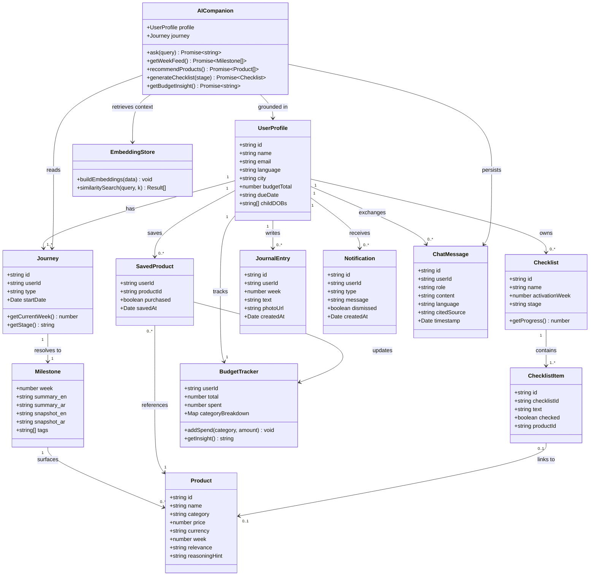
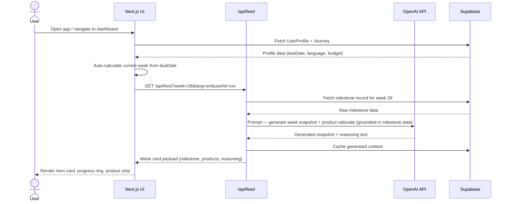
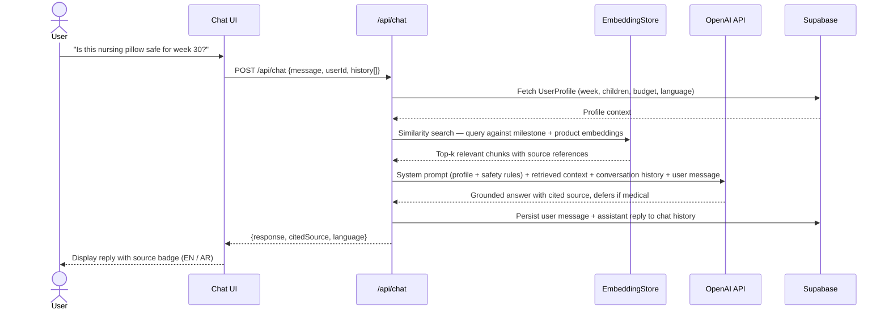
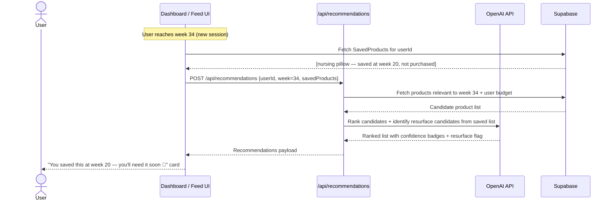
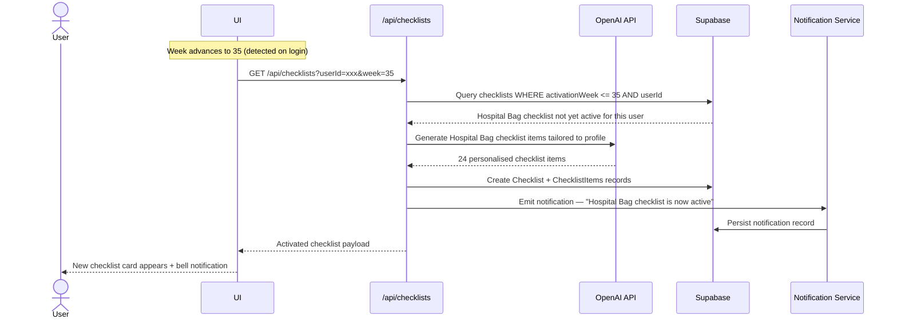

# 🤱 Mumzworld Companion

A personalized parenting OS built as a technical assessment for Mumzworld. The product reorganizes itself around each user's exact week of pregnancy or child's age, their language preference, budget, and city — every time they return, it picks up exactly where they left off.

---

## ✨ Features

The app is organized into 9 modules:

| Module | Description |
|--------|-------------|
| **Profile & Journey Setup** | Onboarding wizard with due date / child DOBs, language, budget, and city. Supports multiple children simultaneously. |
| **This Week Dashboard** | Auto-calculates current week on every visit. Hero card with developmental milestone, progress ring, and quick-action strip. |
| **AI Lifecycle Feed** | Week-by-week AI agent feed showing current week ± context window. Expandable cards with milestone → product reasoning. |
| **Smart Product Recommendations** | Filtered by week, budget, and save history. Confidence badges, wishlist, purchase tracking, and WhatsApp-shareable cards. |
| **Checklist Engine** | AI-generated stage-aware checklists (Hospital Bag, Nursery Setup, Baby-Proofing, etc.) that auto-activate at the right week. |
| **Ask the Companion** | Persistent AI chat grounded in the user's profile. Bilingual, cites sources, and always defers medical questions to a doctor. |
| **Notifications & Nudges** | In-app notification center for week changes, checklist reminders, and product resurfaces. |
| **Bilingual Everything** | Full English / Arabic toggle with RTL layout, Noto Sans Arabic font, and Arabic-Indic numerals. |
| **Onboarding & Empty States** | 4-step onboarding, guest mode, AI-generated empty-state hints, and stage celebration moments. |

---

## 🛠 Tech Stack

| Layer | Technology |
|-------|------------|
| Framework | [Next.js 15](https://nextjs.org/) (App Router) |
| Language | TypeScript |
| Styling | Tailwind CSS |
| UI Components | Radix UI + `class-variance-authority` |
| Icons | Lucide React |
| AI / LLM | OpenAI API (`openai` SDK) |
| Validation | Zod |
| Embeddings | Custom script (`scripts/build-embeddings.ts`) |
| Evals | Vitest + custom eval runner (`scripts/run-evals.ts`) |
| Deployment | Netlify (via `@netlify/plugin-nextjs`) |

---

## 📁 Project Structure

```
.
├── data/               # Raw milestone, product, and checklist data
├── evals/              # Evaluation test cases for AI outputs
├── scripts/
│   ├── build-embeddings.ts   # Generates vector embeddings from data
│   └── run-evals.ts          # Runs evals against the AI agent
├── src/                # Next.js app source (pages, components, API routes)
├── .env.example        # Environment variable template
├── netlify.toml        # Netlify deployment config
├── next.config.ts
├── tailwind.config.ts
└── tsconfig.json
```

---

## 🚀 Getting Started

### Prerequisites

- Node.js 18+
- An OpenAI API key

### Installation

```bash
# 1. Clone the repo
git clone https://github.com/Twist-Turn/MumzWorld-Assessment-Dinesh.git
cd MumzWorld-Assessment-Dinesh

# 2. Install dependencies
npm install

# 3. Set up environment variables
cp .env.example .env.local
# Add your OpenAI API key to .env.local
```

### Environment Variables

```env
OPENAI_API_KEY=sk-your-api-key-here
```

### Running Locally

```bash
npm run dev
```

Open [http://localhost:3000](http://localhost:3000) in your browser.

### Building Embeddings

Before running the app for the first time, generate the vector embeddings from the data files:

```bash
npm run embed
```

### Running Evals

To evaluate AI output quality against the test suite:

```bash
npm run eval
```

### Other Commands

```bash
npm run build       # Production build
npm run start       # Start production server
npm run lint        # Lint the codebase
npm run typecheck   # TypeScript type checking
```

---

## 🌍 Deployment

This project is configured for deployment on **Netlify** using the Next.js plugin. Push to your connected branch and Netlify handles the rest via `netlify.toml`.

---

## 🗺 Product Vision

The full product vision — "Mumzworld Companion" — is a personalized parenting OS designed for mothers in the GCC region. Key design principles:

- **Profile-first**: She sets up once; the entire product reorganizes around her exact week and children.
- **Bilingual by default**: Full Arabic/English parity with RTL layout support.
- **GCC-aware**: AED/SAR currency, city-based localization, WhatsApp sharing as a first-class feature.
- **AI grounded in safety**: The companion never diagnoses — it always defers medical questions to a doctor and cites its sources.

---

## 🗂 Class Diagram

The core domain model showing all entities and their relationships.



---

## 🔁 Sequence Diagrams

### 1 — Dashboard Load

What happens when a user opens the app and the weekly dashboard renders.



---

### 2 — AI Companion Chat

What happens when the user asks the AI companion a question.



---

### 3 — Smart Product Recommendation

How the app resurfaces a product the user saved weeks ago at exactly the right moment.



---

### 4 — Checklist Auto-Activation

How a stage-specific checklist activates when the user crosses a milestone week.



---

## 📄 License

This project was built as a technical assessment and is not intended for production use.
